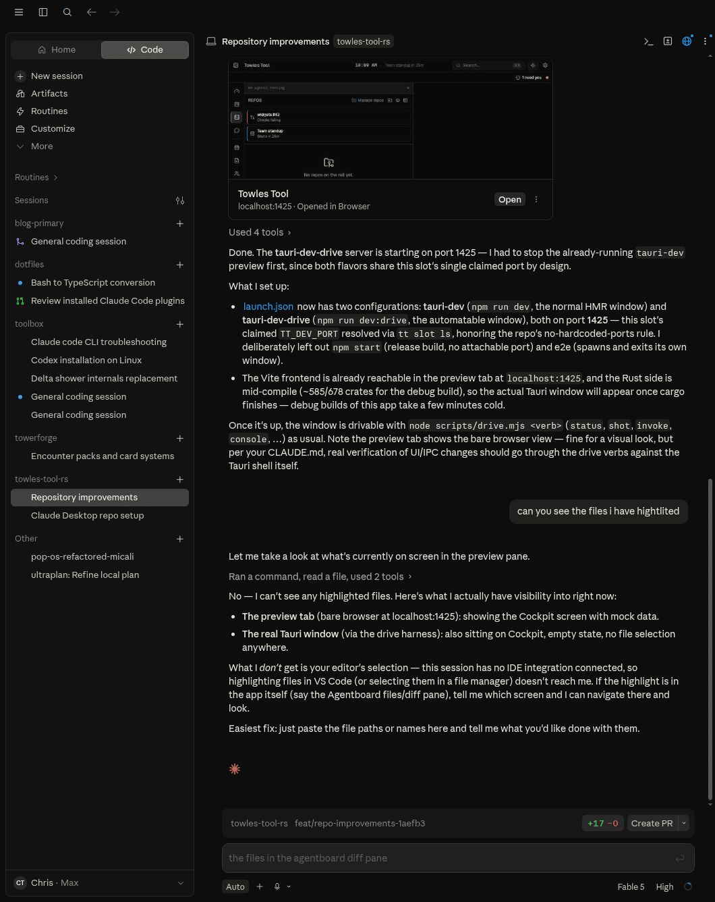

# Towles Tool (Rust)

> [!WARNING]
> **This is a personal playground.** It exists so I can learn by building.
> If you want to steer many coding agents, use
> [Claude Desktop](https://code.claude.com/docs/en/desktop-linux) instead —
> that goes for me too.

A [Tauri 2](https://v2.tauri.app/) desktop app plus the `tt` CLI, built for one
job: **going from steering one coding agent to steering many without going
insane.**

## Why this exists

Two reasons:

1. **The Codex and Claude Code desktop apps didn't run on Linux.** This work
   happens on a Linux desktop, so the shell had to be built. (Claude Desktop
   [now has a Linux beta](https://code.claude.com/docs/en/desktop-linux) —
   released June 30, 2026, the day before this repo's first commit.)

2. **Existing tools were a good GUI or a good TUI, never both.** This app
   aims to be both: a real GUI around real terminals.

## Features: in towles-tool, not yet in Claude Desktop

Checked on 2026-07-19 against Claude Desktop **1.22209.0** (built 2026-07-16),
using the published [docs](https://code.claude.com/docs/en/desktop) plus the
installed bundle. Biggest gap first. Read the overlap list under it too: most
of what this repo does, Desktop now does as well.

- **Full file editor.** The Files pane is a Monaco editor with rust-analyzer
  bridged over Tauri IPC, so hover and completions work on Rust source, and a
  file link printed in a terminal opens the file at the clicked line. Desktop's
  file pane covers spot edits and save, then hands off to "Open in VS Code" for
  anything more. The LSP bridge here is still a spike: it reports
  `starting`/`ready`/`failed` in a chip, which is there to decide whether it
  earns its keep.

- **Editor-selection context.** `tt-ide` is an IDE-protocol server, so an
  outside editor can feed a live selection to a CLI session running in the same
  folder. Desktop only takes context from its own panes, via spot edits,
  "Attach as context", and `@`-mention autocomplete.

  

- **Cross-repo work board.** Board is a kanban of tasks spanning every watched
  repo. Each task links 0..N issues, 0..N PRs, and usually a worktree slot,
  and done rolls up from GitHub PR state. Desktop has nothing like it. Its
  "tasks pane" holds background subagents inside a single session, and no
  cross-repo surface exists.

- **Always-on local event log.** Every subprocess and user action lands as
  JSONL at `<data_dir>/telemetry/events-<date>.jsonl`, rotated daily, tagged
  with `tt.slot`, queryable with `jq`, and never sent anywhere. Desktop's
  OpenTelemetry surface is more configurable than this repo's, but it exports
  to a collector you run. I found no sign of an on-disk log that is on by
  default, though I read strings in the bundle rather than watching it run.

- **Per-slot port isolation.** Both tools put worktrees in
  `.claude/worktrees/`. The difference is that `${tt:port A-B}` claims in
  `.env.example` render each slot its own `.env`, so ten slots run ten dev
  servers without colliding. Desktop's `.worktreeinclude` copies gitignored
  files verbatim, which hands every worktree the same port.

- **Squash-merge-aware landing detection.** The `landed` module in `tt-slots`
  separates uncommitted changes from commits that never reached base, and only
  content-based proof authorizes `git branch -D`. Desktop auto-archives a
  worktree once its PR merges or closes, which covers the common case but
  never has to answer whether a branch with no PR still holds work.

### Overlap: things Desktop already does

Written down so this repo stops claiming them. Desktop ships automatic git
worktrees at the same `.claude/worktrees/` path with auto-archive on PR merge,
a real `node-pty` terminal, a file pane with editing and save-conflict
detection, file-by-file diff review with batched per-line comments, PR CI
monitoring with auto-fix and auto-merge, GUI plugin and MCP management,
scheduled tasks, and a browser pane with element selection. On PR automation
and telemetry configurability it is ahead of this repo.

What Desktop lacks is a shorter list than it first appears. It runs
interactive only, with no `--print` and no headless entry point, so there is no
equivalent of `tt mcp serve` or `tt collect`. The Linux beta also has no
Computer Use, no dictation, and no self-update.

## What this is (and is not)

Claude Code is the harness. This is the layer around it.

**This app is not a harness, and it must never try to become one.** Actually
improving a harness means A/B-testing every change against measured output
quality, and that token spend isn't affordable here — anything cheaper is vibe
testing under ten scenarios and calling it improvement. So this repo has no
agent loop, no prompts of its own, and no opinion about how the model should do
the work. The harness stays Claude Code.

What it owns is the seam on either side of the harness:

- **Handing work in.** A new task should cost one gesture: goal → branch →
  isolated worktree with its own ports, agent already started on the goal.
  That's `tt slot` and the Agentboard `+` button.
- **Understanding the work coming out.** Which session needs you *right now*,
  what each one did, what it cost in tokens, and a real terminal to drop into
  when it's your turn — without re-reading every line an agent wrote.

The target is the space between a **dark factory**, where agents do the work
and you never see the code, and an **IDE**, where you see every line. One agent
fits in an IDE; a fleet doesn't fit in your head. Every feature here is judged
by one question: does it reduce the mental load of running many agents at once?

## Core goal: your focus is the last piece of personal data, and it's yours

Every other piece of your data has already been packaged up and sold —
purchases, location, browsing, attention on every feed. Focus is what's left:
where your mind actually went, minute to minute, across a day of steering
agents. This app's job is to help *you* manage that, not to let it become a
product sold to whoever bids for it.

That only works if the record is honest and stays on your machine. So every
user-initiated action in this app — not just the subprocesses it spawns — is
instrumented via `tracing` into the local event log (see `tt-otel` in
[CLAUDE.md](CLAUDE.md#architecture)). The point isn't surveillance; it's the
opposite: so *you* can later mine your own behavior — "where did my attention
actually go, and did this app respect it or steal it?" — instead of taking
either on faith. It never leaves your machine, and it's the reason a bug like
"this stole my focus while I wasn't looking" is answerable from a log instead
of a guess.

## The two surfaces

**The desktop app** is the primary product — a day-focus shell for staying in
the zone while agents work:

- **Agentboard** — the fleet in one rail: every watched repo, its worktree
  slots, and a live terminal per session, rendered on canvas from a real PTY
  (the `tt-vt` engine, built on libghostty-vt). Agent status is *reported,
  never re-rendered*: the app tells you a session needs attention, and you
  interact in the actual terminal, not a reconstruction of it. The `+` button
  on a repo runs the whole hand-off — goal → branch → new slot, with Claude
  started on the goal.
- **Cockpit** — the default day home: time until the next meeting (that is the
  entire calendar feature, by design), your PRs with CI status, and the issue
  queue.
- **Board** — cross-repo kanban of tasks (#339): each links issues/PRs and usually a worktree slot; done rolls up from GitHub.
- **Claude Sessions** — where the tokens went: per-session accounting, ranked
  waste insights, and a turn/tool drill-down.

**The CLI** (`tt`) is the terminal-native half, and deliberately small: journal
and notes, worktree slots (`tt slot`), and the headless entry points everything
else rides on — `mcp serve` and `collect`. There is deliberately no CLI/app
parity: each feature lands on its natural surface, and the shared logic lives in
Tauri-free crates that both consume.

> **Status:** in progress. The journal, worktree slots, the data-hub
> store/collectors, the MCP server, the Claude Sessions screen, and the
> Agentboard screens (with live in-app terminals) are ported. Features land one
> at a time — see [docs/MIGRATION.md](docs/MIGRATION.md).

## Quick start

**Prerequisites**

- Node.js 24+
- Rust (stable toolchain)
- [zig](https://ziglang.org/) 0.15.x on `PATH` — the `tt-vt` terminal engine
  (used by the app's in-canvas terminals) builds against libghostty-vt
- Linux: `webkit2gtk` and the usual Tauri system dependencies
  (see the [Tauri prerequisites](https://v2.tauri.app/start/prerequisites/))

**Run the desktop shell**

```sh
npm install
npm run dev      # tauri dev — launches the app with the Vite frontend
```

Each worktree slot picks its own dev-server port automatically, so multiple
slots run concurrently.

**Run the CLI**

```sh
cargo run -p tt-cli -- slot ls
```

## Worktree slots

Slots are the "handing work in" half made concrete: branch-named git worktrees
nested inside the checkout at `.claude/worktrees/<name>/` — Claude Code's
native worktree location — one per parallel line of work, each with its own
rendered `.env` (port-pool claims, inherited secrets) so concurrent agents
never collide on ports or state. Any plain git checkout becomes slot-capable
with `tt slot init`; slots are ephemeral — created for a branch, removed when
it merges. Manage them with `tt slot` (`init`, `new`, `ls`, `env`, `rm`,
`clean`) — never raw `git worktree`. Claude Code's own worktree surfaces
(`claude --worktree`, the app's parallel sessions) route through the same
machinery via the `WorktreeCreate`/`WorktreeRemove` hooks. The Agentboard rail
shows the whole fleet and can create a slot from its `+` button. Full
convention and rules: [CLAUDE.md](CLAUDE.md).

## Claude Code plugin

The repo doubles as a Claude Code plugin marketplace. The `tt` plugin (in
[`packages/core`](packages/core/README.md)) packages the map-vs-territory
workflow commands, numbered so they sort in workflow order — `0x` before
implementation (`/tt:01-blindspot`, `/tt:02-brainstorm`, `/tt:03-interview`,
`/tt:04-references`), `1x` plan/during (`/tt:10-plan`), `2x` after
(`/tt:20-pitch`, `/tt:21-comprehend`, `/tt:22-memories`) — plus the
`towles-tool` skill.

Install it in Claude Code:

```sh
claude plugin marketplace add ChrisTowles/towles-tool-rs
claude plugin enable tt@towles-tool
```

Already installed? Pull the latest version with
`claude plugin marketplace update towles-tool`.

A second, separate plugin — `towles-tool-app` (in
[`packages/app`](packages/app/README.md)) — bridges Claude Code to the
desktop app itself: it registers the app's MCP server (`tt mcp serve` — day
brief, needs-you, PR/issue status, board tasks, journal), ships the
`slot-onboarding` skill (guides onboarding any repo onto worktree slots), and
a hook that nudges a running app instance to refresh its PR or issue data
immediately after a `gh pr`/`gh issue` mutation, instead of waiting for its
normal poll interval. Enable it the same way:
`claude plugin enable towles-tool-app@towles-tool`.

## Commands

The CLI binary is `tt`. Run any command with `--help` for its flags.

- `journal daily-notes|note|meeting|jot|open|list|search` — filesystem notes with date-token path templates (`today` is an alias for `daily-notes`; `jot` appends a timestamped bullet without opening an editor).
- `slot init|new|ls|rm|env|clean` — manage worktree slots (see [Worktree slots](#worktree-slots) above). `hook-create`/`hook-remove` are the Claude Code `WorktreeCreate`/`WorktreeRemove` hook shells, not meant to be run by hand.
- `collect calendar|issues|prs|slack|all|status|nudge <prs|issues>` — fill the local store: today's calendar via `claude -p`, assigned issues and open/review-requested PRs via `gh`, and a watched Slack DM; `status` reports each collector's health; `nudge <prs|issues>` makes a running app instance refresh that data immediately instead of waiting for its normal poll interval (used by the `towles-tool-app` plugin's `gh pr`/`gh issue` mutation hook).
- `mcp serve` — stdio MCP server exposing the board's task family to any Claude session: `task_list` and `task_status` read, `task_create` mutates (register with `claude mcp add tt -- tt mcp serve`). The one mutation sits behind the `mcp.mutationsEnabled` setting, default off and re-read per call, so prompt injection cannot self-approve it. See `crates/tt-mcp`'s trust-boundary doc.

## Crates

Cargo workspace with Tauri-free shared crates plus the CLI and Tauri shells:

- `crates/tt-config` — settings (shared on disk with the TypeScript CLI) and the single resolver for every mutable state path.
- `crates/tt-exec` — process/command wrappers.
- `crates/tt-journal` — journal/note logic and date-token path templating.
- `crates/tt-git` — git/GitHub helpers (branch names, PR content, issue parsing).
- `crates/tt-claude-sessions` — session token accounting, ranked waste insights, and the per-session drill-down behind the app's Claude Sessions screen.
- `crates/tt-doctor` — dependency/environment checks behind the app's Doctor screen.
- `crates/tt-slots` — the worktree-slot convention: `${tt:...}` env-template renderer with port-pool claims, slot naming/layout, removal guards, and the shared `ops` orchestration behind `tt slot` and the app.
- `crates/tt-claude-code` — shared Claude Code transcript parsing (session JSONL, titles, token usage, model table).
- `crates/tt-store` — the data-hub SQLite store (events, board tasks with issue/PR links + slot bindings, issues, PR status, collector freshness).
- `crates/tt-collect` — collectors that fill the store: calendar via `claude -p`, issues/PRs via `gh`, a watched Slack DM via the Slack Web API.
- `crates/tt-agentboard` — watched-repo and agent-session tracking behind the Agentboard screen.
- `crates/tt-ide` — Claude Code IDE-protocol core: the MCP/JSON-RPC dispatcher and lockfile schema the app uses to pose as an IDE that Claude Code sessions connect to.
- `crates/tt-vt` — libghostty-vt terminal-state engine driving the app's canvas terminals (needs zig 0.15.x).
- `crates/tt-mcp` — stdio JSON-RPC MCP server over the store and live sessions.
- `crates/tt-otel` — telemetry: the `tracing` subscriber and the local JSONL
  event log every subprocess and user action lands in.
- `crates/tt-update` — GitHub Releases update check for the running app.
- `crates-cli/tt-cli` — the `clap` CLI (binary `tt`).
- `crates-tauri/tt-app` — the Tauri 2 desktop shell; `apps/client` is its React + Vite frontend.

## Lineage

This is a Rust rewrite of the original TypeScript `towles-tool`, now archived
and renamed to
[`towles-tool-tmux`](https://github.com/ChrisTowles/towles-tool-tmux) — its
tmux-based AgentBoard is kept there as a reference example. The repo structure
follows the [Yaak](https://github.com/mountain-loop/yaak) golden template — a
Cargo workspace with Tauri-free shared crates, a `clap` CLI, and a React + Vite
frontend (see [ATTRIBUTION.md](ATTRIBUTION.md)). The binary is **`tt`**; the
`ttr` → `tt` cutover from the TypeScript CLI happened 2026-07-13 — hard
cutover, no `ttr` alias left behind (see [docs/CUTOVER.md](docs/CUTOVER.md)).
Features port over selectively per [docs/MIGRATION.md](docs/MIGRATION.md).

## More

- [packages/core/README.md](packages/core/README.md) — the `tt` Claude Code plugin in detail
- [packages/app/README.md](packages/app/README.md) — the `towles-tool-app` Claude Code plugin in detail
- [ATTRIBUTION.md](ATTRIBUTION.md) — derivation from Yaak and its MIT license
- [docs/MIGRATION.md](docs/MIGRATION.md) — the feature-port backlog
- [docs/CODING-STANDARDS.md](docs/CODING-STANDARDS.md) — Rust/TypeScript coding standards
- [e2e/README.md](e2e/README.md) — driving the real app shell (live-drive + regression suite)
- [CLAUDE.md](CLAUDE.md) — project instructions, architecture, and the worktree-slot workflow

## License

MIT © 2026 Chris Towles. See [LICENSE.md](LICENSE.md).
